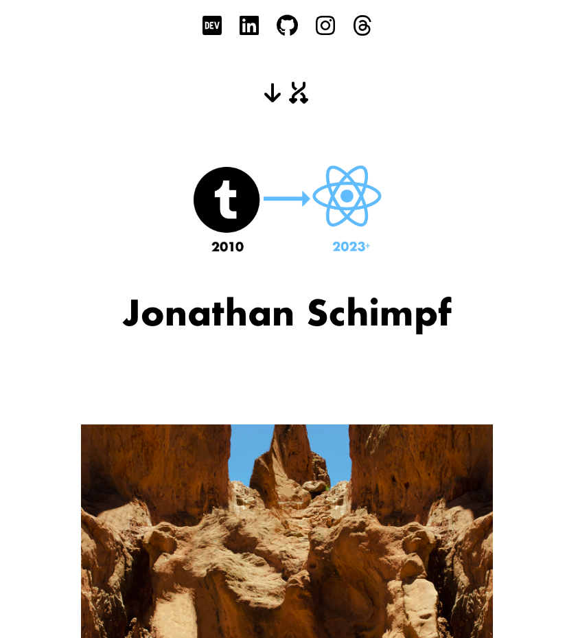

&nbsp;

# [From a Tumblr Account to a React App](https://jonathanschimpf.com/)

&nbsp;

&nbsp;

---

&nbsp;

## ✍️ About This Project

&nbsp;

Data is stored in a `.json` file which holds an array of objects—each representing a photo and its original caption. The media was exported from my Tumblr archive and parsed using custom Python scripts to extract and structure the metadata.

The UI is built in React and uses Infinite Scroll for seamless navigation. A few custom icons enable smooth top/bottom jumping to make browsing an old photo journal more enjoyable.

This site is now continuously deployed using **Netlify** — pushing updates straight from GitHub.

&nbsp;

---

&nbsp;

## Credits

&nbsp;

**Third-party assets:**

- [`React.js`](https://reactjs.org/) — A declarative JavaScript library for building user interfaces
- [`React-Bootstrap`](https://react-bootstrap.github.io/) — Bootstrap components rebuilt for React
- [`Bootstrap`](https://getbootstrap.com/) — Open-source CSS framework
- [`GitHub Pages`](https://pages.github.com/) — Former deployment method 🚫
- [`Netlify`](https://www.netlify.com/) — Current deployment platform (CD enabled) ✅

&nbsp;

---

&nbsp;

## Questions?

&nbsp;

Shoot me an email → [jonathan@jonathanschimpf.com](mailto:jonathan@jonathanschimpf.com)

&nbsp;

---

📸 **Preview**  
Photo journal rebuilt from Tumblr → React (2010–2023+)

&nbsp;

&nbsp;

&nbsp;

## ✍️ README co-authored by a GPT

✨ A GPT helped write this README — because it’s 2025.

&nbsp;

